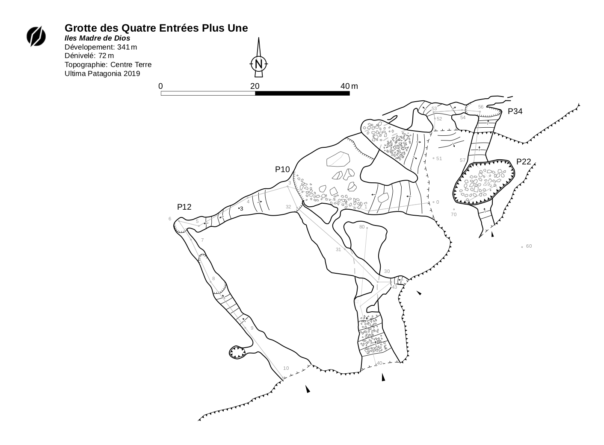

# Projet Topo Ultima Patagonia

Bienvenue sur la page du projet Ultima Patagonia ©CentreTerre 2022!

Vous trouverez ici les informations attenantes aux prospections et explorations des archipels calcaires de la Patagonie Chilienne.

- [Projet Topo Ultima Patagonia](#projet-topo-ultima-patagonia)
  - [Contribuer](#contribuer)
    - [Organisation du projet](#organisation-du-projet)
    - [Pourquoi Therion?](#pourquoi-therion?)
    - [Logique de nomenclature](#logique-de-nomenclature)
    - [Le fichier de données Therion](#le-fichier-de-données-therion)
    - [Le fichier de configuration Therion](#le-fichier-de-configuration-therion)
  - [Utiliser cet outil](#utiliser-cet-outil)
  - [Visualisations](#visualisations)
  - [Téléchargements](#téléchargements)
  - [Le Sig](#le-sig)
  - [Prérequis](#prérequis)

Un résumé des cavités explorées est accessible sur ce lien:

[Synthèse des cavités explorées](../data/table.html)

## Contribuer

### Organisation du projet

Les pointages de cavités explorées durant les projet Ultima Patagonia, menées par Centre Terre en Patagonie Chilienne, ont fait l'objet d'une organisation selon un découpage cadastral.
Chaque cavité se voit donc attribuer un numéro de cadastre unique, à six chiffres, indiquant au passage dans quel secteur elle se trouve.
Le premier chiffre dénote l'île dans laquelle se trouve la cavité, les 2e et 3e chiffres le secteur précis d'exploration, et les trois derniers identifient la cavité dans ce secteur.
Ainsi, la grotte de l'éveque Cauchon (# 204002) est la cavité 002 du secteur 204 (Camp 2, île de Madre de Dios, sud)

Le cadastre s'organise comme suit:

```
1 - nord de l'île Madre de Dios
  101 MDD Nord-Ouest
  102 Isla Augusta
  103 MDD Nord
  104 Résurgence Ouest
  105 Grand Lac
  106 Seno Egg
  107 Barros Luco
    107001 Gouffre du Jackpot
    107002 Résurgence Hongo
    ...
  108 Sumidero
  109 Trois Entrées
  11O Passe Kawèsqar

2 - sud de l'île Madre de Dios
  201 Grande Barriere
  202 Isla Ramon
  203 Pacifique
  204 Camp 2
  205 Baleine
  206 Roberto
  207 Condors
  208 Lobos
  209 Soplador
  210 Seno Norte
  211 Quincas
  212 Tarlton
  213 Guarello

3 - Ile Diego de Almagro
  301 Isla Augustin
  302 Cabo Tapias
  303 Pelantaro
  304 Avenir
  305 DDA Centre
  306 DDA Sud-Ouest
```

Le découpage se fait donc de manière géographique, et certains secteurs qui ont été prospectés durant plusieurs expéditions comprennent donc les pointages de celle-ci. A noter que la numérotation des grottes dans chaque secteur ne suit aucune logique d'ancienneté d'exploration ou de longueur/profondeur de dévéloppement. Il s'agit simplement de s'affranchir d'erreur de transcriptions/traductions de noms. Un seul numéro réfère donc à une unique cavité, qui par ailleurs peut être connue sous d'autres noms.


### Pourquoi Therion?



Therion permet en principe de stocker les données topos de manière pérenne et accessible. Les croquis/esquisses peuvent être recompilées à plusieurs échelles, et selon différents styles, en fonction des besoins (topo à imprimer pour un rapport, topo à imprimer pour guider l'exploration, topo à inclure dans une présentation power point, etc.)
Les données de base restent inchangées, la façon de les présenter est codifiée en clair dans un fichier de configuration différent des fichiers de données.
Cela permet aussi de former une base de données SIG, et d'exporter les informations géographiques d'un fichier de synthèse sous plusieurs formats.

### Logique de nomenclature

La nomenclature des fichiers et de dossiers suit une certaine logique afin de minimiser les confusions, à savoir la PoliceChameau (CamelCase).
Ainsi la 'faille du coinceur' devient _FailleDuCoinceur_, la perte ambrée devient _PerteAmbree_.
A noter que les lettres accentuées sont éliminées.

Les données topographiques de la grotte Audeline (_#205031_) se trouvent donc dans le dossier `205/GrotteAudeline/`

### Contribuer

#### Le fichier de données Therion
Toutes les données topos contenues dans un fichier de données Therion (`Fichier.th`) peut être ouvert à l'aide d'un éditeur de texte de votre choix.

Le fichier prend la forme suivante (les symboles # indiquent les commentaires, ils sont donc ignorés lors de la compilation des données)w:

```
survey {Cavite} -title "Le nom de la cavité" \
                -entrance "nom de la station d'entrée" \
                -attr exped "Le nom de l'expédition" \
                -attr cad_num "Le numéro cadastral"

input {Cavite}_p.th2  # ceci est un fichier croquis topo, un plan, mis au propre, qui peut être ouvert sur Inkscape
input {Cavite}_e.th2 # ceci est un fichier croquis topo, une coupe, mis au propre, qui peut être ouvert sur Inkscape


centreline
 team "NomTopographe1 Prénom" role
 team "NomTopographe2 Prénom" role
 date AAAA.MM.JJ
 explo-date AAAA.MM.JJ

 units length meters
 units compass clino degrees
 data normal from to tape compass clino
 1 2 ... ... ... # station 1 à 2, décamètre, azimuth, inclinaison
 2 3 ... ... ...
 ...
endcentreline

endsurvey
```

Les métadonnées de chaque sortie topo peuvent être ajoutées en "plain text" dans le fichier `Cavite.th` approprié. A noter que les attributs `entrance` `cad_num`et `exped` sont à renseigner pour le tableau récapitulatif des explorations.

#### Organisation des données Therion

Par symmetrie par rapport à l'organisation des dossiers, les fichiers de données Therion sont organisés de manière hiérarchique.
Chaque cavité est dotée d'un fichier de type `Secteur/LaCavite/LaCavite.th`  qui contient les données topo.
Chaque secteur est aussi doté d'un fichier de type `Secteur/Secteur.th`, à l'intérieur duquel on fait appel de manière récursive aux données topo de chaque cavité.

Les coordonnées des entrées de chaque grotte s'inscrivent dans le fichier secteur.
Le fichier secteur s'organise comme suit:

```
survey Secteur -title "Nom du secteur"

input CaviteA/CaviteA.th
input CaviteB/CaviteB.th
...
input CaviteZ/CaviteZ.th


centreline
  fix ENT_XXXXX1 CoordX CoordY CoordZ  # creation d'un pointage à nom unique
  station ENT_XXXXX1 "commentaire"     # un commentaire quelconque sur le pointage
  equate ENT_XXXXX1 ENT@CaviteA        # on jonctionne la station d'entrée de la cavité A (station ENT) avec le pointage GPS ENT_XXXXX1

  ...

  fix ENT_XXXX26 CoordX CoordY CoordZ  # creation d'un pointage à nom unique
  station ENT_XXXX26 "commentaire"     # un commentaire quelconque sur le pointage
  equate ENT_XXXX26 ENT@CaviteZ        # on jonctionne la station d'entrée de la cavité Z (station ENT) avec le pointage GPS ENT_XXXX26
endcentreline

endsurvey
```

Ce système permet notamment de créer un point fixe pour chacune des cavités auxquelles ne sont rattachées aucunes données topos (celles dont on détient par exemple un croquis mais pas plus).
Celles pour lesquelles on dispose de données topos sont donc bien géolocalisées comme il se doit.

Enfin, le fichier maître, `index.th` appelle de manière récursive les fichiers de chaque secteur et donc, de chaque cavité qui s'y trouve.

#### Le fichier de configuration Therion

## Utiliser cet outil

### Entrer des données topos

L'entrée de données topo, autrement dit la création d'un fichier `CaviteX.th` peut se faire de multiples manières, qui sont détaillées ci-dessous.

#### Importation de fichiers Topodroid

Admettant que les données aient été travaillées sur Topodroid, il est possible, à partir de la l'application elle-même d'exporter un fichier .th. Celui-ci peut tout simplement être copié-collé dans le dossier correspondant.
Bien faire attention cependant à renseigner les attributs spéciaux du nom du point topo d'entrée, de numéro cadastral et du nom de l'expédition durant laquelle la cavité a été explorée.


#### Entrée manuelle de données

Pour une explication détaillée de l'entrée manuelle de données, il faut se référer au manuel de Therion. En bref, on effectue un copié-collé du modèle `template.th`, et on renseigne les relevés topo entre les balises `centreline` et `endcentreline`.

Pour les données topo "ordinaires", on utilisera le modèle suivant:

```
centreline
units length meters
units compass clino degrees
data normal from to tape compass clino
1 2 ... ... ..
2 3 ... ... ..

endcentreline
```
A bien noter que pour les données de plongée on utilisera plutôt:

```
centreline
units length meters
units compass clino degrees
data diving from fromdepth to todepth tape compass
1 0 2 -1 ... ..
2 -1 3 -2 ... ..

endcentreline
```

### Export de la levée topo pour mise au propre

L'export d'une feuille, ou d'un atlas de feuilles au format A4 contenant le tracé avec point topos numérotés d'une cavité nouvellement explorée se fait au moyen du fichier de configuration Therion suivant. On crée dans le dossier `Secteur/Cavite/` un fichier texte nommé `TraceTopo.thconfig`.

On copie le code ci-dessous:

```
source <Cavite>.th

input ../../../layouts/metapost/scalebar_arrow.thl

layout local
  copy custom_scalebar
  scale 1 500
  grid top
  grid-size 5 5 5 m
  symbol-colour point station-name [20 20 80]
  colour map-fg [90 90 90]
  map-header 0 100 sw
endlayout

export map -o <Cavite>-trace-topo-p.pdf -layout local -layout-debug station-names -projection plan

export map -o <Cavite>-trace-topo-e.pdf -layout local -layout-debug station-names -projection extended
```

Sinon, on utilise le script ci-dessous:

```
python3 scripts/trace-topo-A4.py data/<Secteur>/Cavite/Cavite.th <Xoffset> <Yoffset>
```


### Le SIG

## Prérequis

Afin de compiler les données topos du projet, vous devrez installer certains logiciels, détaillés ci-dessous.

Pour la compilation et l'export de données topos:

- [Therion](https://therion.speleo.sk/download.php) - la pièce de résistance.
- [Survex](https://survex.com/download.html) - un programme pour produire les fichiers `.3D`

Pour mettre au propre les topographies, vous pourez utiliser `Inkscape` et son extension `Therion`, qui sont plus agréables et intuitifs à utiliser que l'éditeur natif de `Therion`.

- [Inkscape](https://inkscape.org) - un programme de dessins vectoriels
- [Inkscape Therion Extensions](https://github.com/speleo3/inkscape-speleo/) l'extension qui permet d'éditer les croquis sous format `Therion`.

Pour éditer les fichiers texte (optionel):

- [VSCode](https://code.visualstudio.com/Download) un éditeur de texte
- [VSCode Therion Extension](https://marketplace.visualstudio.com/items?itemName=rhystyers.therion) une extension qui met en couleur la syntaxe `Therion`.
